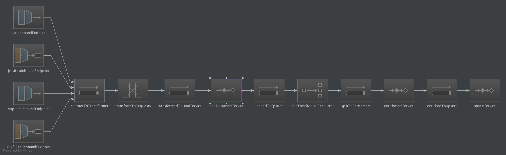

Index Document Server
=====================
#Indexer
This microservice reads the resource location or content from an message on a Kafka topic and/or RabbitMq queue, it 
then reads contents and persists the contents to an index based on the published date.
 
 
Currently all invocations are via kafka, but a REST api could easily be added using the http end point and adding at webserver to the boot configuration.

Therefore it is possible to override the following settings;

| dot.notation | Description | Default '' |
| ------------ | ----------- | ---------- |
| `elasticsearch.httpAddresses[0].host` | The first name of the ElasticSearch host (or IP Address) | `localhost` |
| `elasticsearch.httpAddresses[0].port` | The first name of the ElasticSearch port | `9300` |
| `elasticsearch.httpAddresses[1].host` | The second name of the ElasticSearch host (or IP Address) | |
| `elasticsearch.httpAddresses[1].port` | The second name of the ElasticSearch port |  |
 

##Design

This enrichment micro-service is a [Spring Integration&trade;](https://projects.spring.io/spring-integration/) hosted in a (non-web) [Spring Boot&trade;](http://projects.spring.io/spring-boot/) container.

###Spring integration&trade;
 Spring Integration&trade; was used to separate the implementation of the business logic from the technical and structural wiring of the application.
 i.e.the business services should not be aware of the message transport layer (or threading model or transaction model or retry model) that is being implemented.
 
 The business service layer should only be concerned with the implementation of the business logic, this `Separation Of Concerns` 
 is aided by the use of the Spring Integration&trade; framework, as the definition of the protocols, transformations and 
 threadpools are defined as part of the framework and not inside any business service.
     
 Thus the current implementation can concentrate on the implementation (and testing) of the services: 
 * _TransformationSerivce_ 
    Translates the inbound single Json into request specific payload objects
 * _EnrichmentService_ 
    Adds/Enriches  the 'Data'; currently only determines which index to persist to.
 * _InsertService_ 
    Insert the record into elastic,
    
The current integration flow is above but this could easily be amended to include other inbound and outbound endpoints, 
primarily by only be including new configuration.

###Spring Boot&trade;
We are using Spring Boot&trade; without a Webserver as this creates an easy to manage deployment artifact within a single
self-executable jar file.
(We have experienced classloader issues with uber-jar/jar-with-dependencies, that we have not with Spring Boots specialized classloader).

Currently we are building an executable jar file that can be executed directly, the AWS Keys are required to be exposed
 as environment variables 
    

## Appendix
###Polymorphic Messaging via Json Wrapper Objects

Jackson Json parser configuration can be set up to accept different messages over the same inbound topic, by using a Json wrapping
 object. It is relatively simple to add WRAPPED_OBJECT annotation to a common Request ancestor and if Jackson is registered with all decedents (see Google Reflections) it 
 can be correctly instantiate the correct request instance and thereby enablespolymorphic messaging over the same inbound topic; 
 
Spring Integration would then invoke the correct method on the _Services+_ based on the type of Request, rather than having logic in the TransformationService 
to determien the type

> If you where to implement more polymorphic solutions then it would make sense to replace the direct invocation of the service object from 
> Sprint Integration&trade; with a _facade_ which could then delegate to the correct service.
> You could then implement, for example, a `DatabaseService`, `ElasticSearchService` and a `S3Service` all fronted be a `DocumentLoaderFacade`
>

